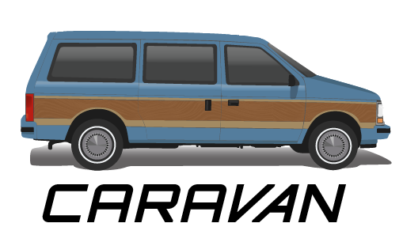
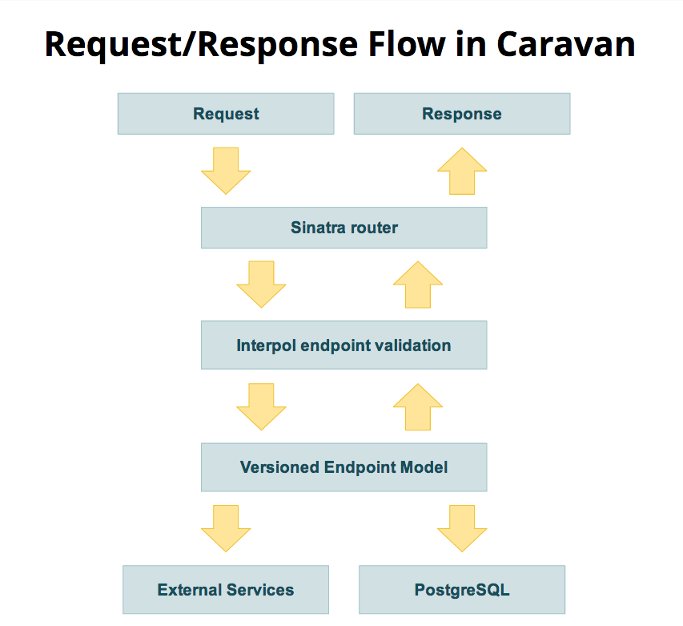

This project is just a template used to document some of the best practices
learned while working on a very complex [Sinatra][sinatra] API project with
[Moz][].  This project has far fewer moving parts, but a large part of
what makes Moz's model significant is how they designed their Sinatra
application for maintainability and modularity.

This project is not intended to be used as a gem, but to serve as a living
example of robust API architecture and design.

## Getting Started

First, clone the project and open its directory: `git clone
git://gitlab.com/sigmavirus24/caravan` and `cd caravan/`

`./script/bootstrap` will run `bundle` and then create the database for you.

### Using the rake tasks

All of the database tasks, except for `db:new_migrations`, rely on the
configuration in `config/database.yml`.

    rake cane                              # Run cane to check code quality / Check code quality metrics with cane
    rake db:bootstrap                      # A task for doing everything to set up this project
    rake db:console                        # Provide access to the database via the Sequel gem
    rake db:create                         # Create a new database
    rake db:drop                           # Drop the database
    rake db:migrate                        # Run the migrations on the database
    rake db:new_migration[migration_name]  # Create the skeleton for a new migration
    rake db:recreate                       # Recreate the database
    rake spec                              # Run RSpec code examples

The default rake task (`rake`) will run [cane](https://github.com/square/cane)
and [rspec](https://github.com/rspec/rspec).  After running the specs, a
coverage report will be generated.

Some of the rake tasks provide convenient database combos:

* Use `rake db:bootstrap` to create and migrate the database (based on
  settings from `config/database.yml`.

* Use `rake db:recreate` to drop, create, and migrate the database.

* `rake db:new_migration[migration_name]` will generate a skeleton for a new
  migration on the database. For example, `rake db:new_migration[add_users]`
  will create a migration in `db/migrate` called `0001_add_users`. Unless you
  already have another migration.

## The request/response cycle

### Request

Requests to Caravan can return default (preferred) version or
 requested version. To request a specific version, specify the version
 number in the accept header. For example:

  Accept: application/json; v=2.0

Some endpoints require sending parameters via the URL. Others will require
 them to be sent as part of the request body. All parameters sent will be
 validated. If they are invalid, you will receive a 403 response.

### Response

All responses return JSON. The JSON response is validated against the
 endpoint definitions. Response types generally are 200, 204, or 404
 if the request was valid and the response body was valid. If Caravan
 generates a response body that does not validate, you will receive
 a 500 response.

### Sinatra Router

More information about Sinatra and how it handles routing can be found on its
[website][sinatra].

### Interpol endpoint validation

[Interpol][] is an open source toolkit for policing your HTTP JSON interface
maintained by [Moz][]. It uses YAML files with definitions of the expected
request and the promised response. These are called endpoint definitions.
Caravan uses Interpol to enforce a contract with the consumer of the JSON
interface.

When a request is made to Caravan, the request is parsed and validated by
Interpol. If the request is not in the form that Interpol expects, the
client will receive an error. If the request is valid, Interpol will then
validate the response that Caravan generates to ensure it is what the consumer
expects.

### Versioned Endpoint Model

[Interpol][] allows for endpoint definitions to be versioned as such we can
define independent Endpoint Models to provide different versions of an
endpoint. Typically the preferred version is the highest version number so if
the consumer does not specify the version they want, they will get the newest
version of the endpoint.

### External Services

These can be any API or HTTP service with whitch you wish Caravan to communicate.

## Project structure

Here's a quick look at the directory structure of the project:

    .
    ├── bin
    ├── config
    ├── db
    │   └── migrate
    ├── lib
    │   ├── apps
    │   ├── endpoint_definitions
    │   ├── endpoint_models
    │   ├── models
    │   ├── tasks
    │   └── util
    ├── script
    │   ├── bootstrap
    │   └── test
    └── spec
        ├── acceptance
        ├── integration
        │   └── endpoint_models
        ├── spec_helpers
        └── unit
            ├── endpoint_models
            └── models

The importance of the directory structure is that it lends itself to keeping
one's concerns separated. The importance of each directory is explained in
short below, and in greater detail in the READMEs placed in each directory.

### `lib/apps`

In our client's case, this part of their infrastructure provides access to a
large number of resources. As such, keeping the resources (or endpoints)
organized helps and splitting them up into several smaller apps helps with
that organization. The pattern used to keep items organized is by using the
structure of the routes. For example, if you have a route that to the end user
is structured `/users/:user_id/some_resource`, you might make an app
specifically to hold all of the resources for `/users`.

### `lib/endpoint_definitions`

This directory contains all of the schema definitions for endpoint request and
responses.

### `lib/endpoint_models`

Lorem ipsum

### `lib/models`

Lorem ipsum

[sinatra]: http://sinatrarb.com/
[Moz]: http://moz.com/
[Interpol]: https://github.com/seomoz/interpol
